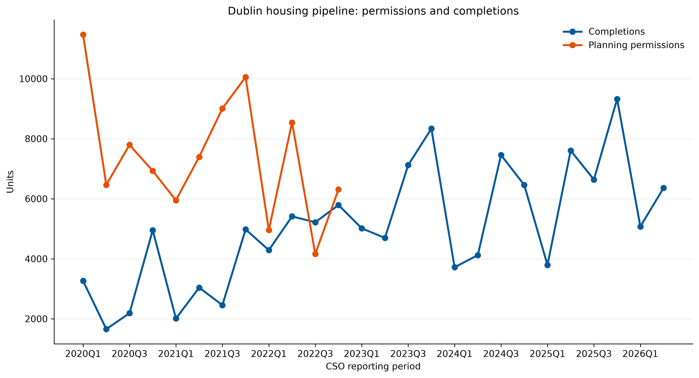

# Dublin Housing Market Intelligence

## Executive Summary (BLUF)
 

**Bottom line:** Dublin planning permissions are an early indicator of future supply, while completions are the delivered stock. The two series should not be expected to move together in the same quarter: permissions must pass through design, finance, procurement, construction and certification before a home is completed. This pipeline makes that lead-time relationship visible using the latest CSO PxStat data for Dublin City, Fingal, South Dublin and Dún Laoghaire-Rathdown.

The output is reproducible: every run fetches the three CSO cubes, filters to the four local authorities, aggregates duplicate observations, merges the metrics by authority and reporting period, and regenerates the chart.

The published output is restricted to reporting periods from **2020 through 2026 inclusive**. The accompanying SQL model calculates annual completion growth and each authority's share of Dublin delivery, while the Power BI specification defines the executive reporting layer.

## C-Suite Executive Policy Briefing

### GDA Housing Delivery Bottlenecks: Utility Infrastructure Constraints (Uisce Éireann & ESB)

**Decision implication:** a rise in permissions should not be treated as near-term housing delivery unless water and electricity capacity are available at the same time as land, finance, and construction capacity. The 2020–2026 dashboard should therefore be read alongside infrastructure-readiness evidence, particularly for Fingal and South Dublin.

**Water treatment capacity risk:** Uisce Éireann's water and wastewater investment programme identifies capacity, network upgrades, and connection requirements as dependencies for new development. Where a receiving water or wastewater treatment system is constrained, planning permission can precede a connection solution, creating a queue between consent and occupation. For Fingal and South Dublin, this creates a material risk that permissions overstate deliverable supply until treatment capacity and network reinforcement are confirmed. See [Uisce Éireann's Connections and Developer Services](https://www.water.ie/connections/) and its [Capital Investment Plan](https://www.water.ie/projects-plans/investment-plan/).

**Electrical grid connection lag:** ESB Networks connection applications require assessment, design, quotation, payment, and construction before energisation. Capacity constraints or reinforcement requirements can therefore add a separate lead time after planning approval, especially on large housing schemes and growth corridors. Fingal and South Dublin should be monitored for permission-to-completion divergence where grid connection milestones are not aligned with the build programme. See [ESB Networks' getting connected guidance](https://www.esbnetworks.ie/new-connections) and [CRU network development information](https://www.cru.ie/).

These are **portfolio-level policy risks, not claims that every scheme in either authority is blocked**. The next diligence step is to link each major permitted scheme to a confirmed Uisce Éireann connection/capacity position and an ESB Networks connection offer or energisation milestone. The CSO series show the market outcome; they do not identify the infrastructure cause of an individual delay.

## Outputs

- `data/dublin_housing_summary.csv`: tidy authority-period data containing completions, planning permissions and the HPM06 Dublin residential property price index where reporting periods align.
- `assets/dublin_housing_trends.png`: Dublin-wide line chart comparing completions with planning permissions.
- `transform_housing_data.sql`: production-style CTE model with `LAG()` YoY growth and local-authority delivery shares.
- `POWER_BI_LAYOUT.md`: three-page executive dashboard specification.

## Data Sources

| Metric | CSO PxStat cube |
| --- | --- |
| Completions | `NDQ06` |
| Residential property price index | `HPM06` |
| Planning permissions | `BHQ12` |

The data source is the [CSO PxStat API](https://data.cso.ie/). The pipeline ingests official JSON-stat or CSV datasets directly from CSO Ireland's open data platform.

## Run Locally

```powershell
py -m venv .venv
.\.venv\Scripts\Activate.ps1
python -m pip install -r requirements.txt
python pipeline.py
```

The API root can be overridden for testing or a proxy with `CSO_API_ROOT`.

## Repository Structure
- `pipeline.py` — Automated Python ingestion pipeline for CSO PxStat API.
- `transform_housing_data.sql` — Production CTE models calculating YoY growth & local authority delivery shares.
- `POWER_BI_LAYOUT.md` — Complete 3-page executive dashboard architecture & DAX metrics.
- `data/dublin_housing_summary.csv` — Processed dataset combining completions, permissions, and price indices.
- `assets/dublin_housing_trends.png` — Dublin-wide delivery vs. permission trend visualization.

```

